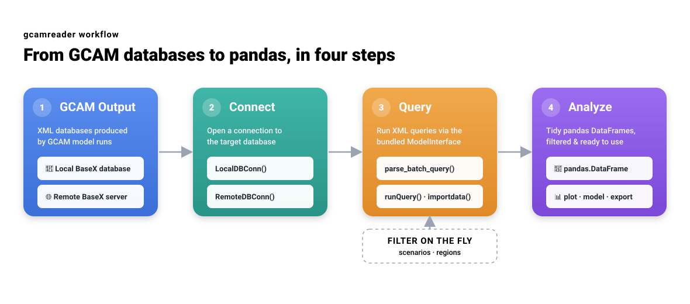

gcamreader
==========

``gcamreader`` provides functions for reading data from the output databases
produced by `GCAM <https://github.com/JGCRI/gcam-core>`_, returning results as
pandas DataFrames.

   From GCAM XML output databases to analysis-ready pandas DataFrames in four
   steps: locate the data, connect, run queries (filtering by scenario and
   region), and analyze.

Contents
--------

.. toctree::
   :maxdepth: 3

   installation
   usage
   cli
   verified_versions
   api
   contributing
   changelog
