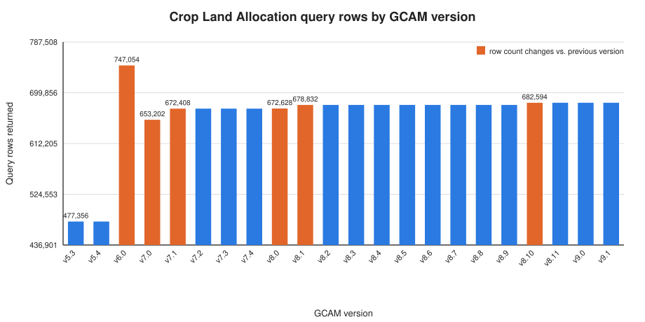

Verified GCAM Versions
======================

``gcamreader`` is regularly exercised against the full range of GCAM output
databases produced by the GCAM continuous-integration runs (GCAM 5.3 through
9.1). This page records the results of that verification, including
per-version performance figures.

.. note::

   These results were produced on an HPC cluster using the harness in
   ``benchmarks/version_compat/``. To regenerate them, see the
   :ref:`reproducing` section below.

Test environment
----------------

================  =============================================
Component         Value
================  =============================================
gcamreader        ``1.5.0``
Python            ``3.13.5``
Java              Temurin OpenJDK ``17.0.18``
Platform          Rocky Linux 9.5 (x86_64), AMD EPYC 7282
Benchmark query   Crop Land Allocation (bundled land query)
Java heap         ``-Xmx16g``
================  =============================================

Each version is verified through three stages: opening a local database
connection, listing the scenarios in the database
(:meth:`~gcamreader.LocalDBConn.listScenariosInDB`), and running the benchmark
land-allocation query (:meth:`~gcamreader.LocalDBConn.runQuery`). A version is
marked **PASS** only when all three stages succeed and the query returns data.

Compatibility matrix
--------------------

**All 22 versions PASS.** Every GCAM release from 5.3 through 9.1 connects,
lists its scenarios, and returns data for the benchmark land-allocation query.

==========  ======  =========  ============  ===============  =============
Version     Status  Scenarios  Query rows    Scenarios (s)    Query (s)
==========  ======  =========  ============  ===============  =============
gcam-v5.3   PASS    1          477,356       1.44             36.63
gcam-v5.4   PASS    1          477,356       1.51             40.81
gcam-v6.0   PASS    1          747,054       1.07             60.19
gcam-v7.0   PASS    1          653,202       0.79             38.47
gcam-v7.1   PASS    1          672,408       0.92             42.20
gcam-v7.2   PASS    1          672,408       0.91             53.03
gcam-v7.3   PASS    1          672,408       0.84             53.78
gcam-v7.4   PASS    1          672,408       0.89             42.09
gcam-v8.0   PASS    1          672,628       2.28             36.38
gcam-v8.1   PASS    1          678,832       0.79             35.43
gcam-v8.2   PASS    1          678,832       0.78             33.55
gcam-v8.3   PASS    1          678,832       0.80             48.86
gcam-v8.4   PASS    1          678,832       0.74             37.06
gcam-v8.5   PASS    1          678,832       0.73             34.97
gcam-v8.6   PASS    1          678,832       0.74             33.24
gcam-v8.7   PASS    1          678,832       0.83             41.55
gcam-v8.8   PASS    1          678,832       0.75             35.47
gcam-v8.9   PASS    1          678,832       0.86             38.34
gcam-v8.10  PASS    1          682,594       0.77             35.91
gcam-v8.11  PASS    1          682,594       0.84             35.51
gcam-v9.0   PASS    1          682,594       0.74             37.86
gcam-v9.1   PASS    1          682,594       0.81             37.00
==========  ======  =========  ============  ===============  =============

Performance figures
-------------------

Listing scenarios is consistently fast (about 0.7–2.3 seconds; the single
outlier near 2.3 s is filesystem warm-up on the first task). The
land-allocation query — which materializes 477k–747k rows — is the dominant
cost, ranging from roughly **33 to 60 seconds** at ``-Xmx16g``.

================================  ===================
Metric (all 22 PASS versions)     Value
================================  ===================
Scenario list time (min / max)    0.73 s / 2.28 s
Query time (min / max)            33.24 s / 60.19 s
Query time (mean)                 ~40 s
Query rows (min / max)            477,356 / 747,054
================================  ===================

Query time scales roughly with the number of rows returned: the largest
database (gcam-v6.0, 747k rows) is also the slowest query (~60 s), while the
smallest (gcam-v5.3/5.4, 477k rows) complete in the mid-30s. The query schema
used by ``gcamreader`` remains compatible across all of these versions without
modification.

.. _query-output-diagnostics:

Query output across versions
----------------------------

The number of rows the Crop Land Allocation query returns is **not constant**
across GCAM versions. The figure below shows the row count for every version;
bars are highlighted where a version changes the row count relative to the
previous version.

Rather than drifting randomly, the row counts fall into **seven discrete
tiers**. Each tier is introduced by a specific GCAM release and then held stable
until the next change. Note that the counts are **not monotonic**: the early
5.x/6.0 land representation differs structurally from the 7.x line that follows,
so the count rises sharply at 6.0 and then resets when the 7.x land module is
introduced.

==========  ============  ==========  ==================================================
First seen  Rows          Change      Interpretation
==========  ============  ==========  ==================================================
gcam-v5.3   477,356       baseline    Earliest land representation (shared by 5.3-5.4).
gcam-v6.0   747,054       +269,698    Largest count: the 6.0 land schema yields the most
                                       land-leaf × year × region combinations of any
                                       version studied.
gcam-v7.0   653,202       -93,852     The 7.x land module is a structural redesign, not
                                       an extension of 6.0 — fewer total combinations.
gcam-v7.1   672,408       +19,206     Expansion of land leaves; stable across 7.1-7.4.
gcam-v8.0   672,628       +220        Minor refinement entering the 8.x line.
gcam-v8.1   678,832       +6,204      Additional land leaves added in 8.1; stable
                                       through 8.9.
gcam-v8.10  682,594       +3,762      Further land-detail expansion; stable through 9.1.
==========  ============  ==========  ==================================================

Why the counts change
~~~~~~~~~~~~~~~~~~~~~~~

The Crop Land Allocation query (see
:doc:`the bundled query <usage>`) returns one row per
*land leaf × year × region* combination that exists in the database. The query
itself is unchanged across this study — every version runs the **identical**
XQuery. The row count therefore tracks the *contents* of each database, not the
behavior of ``gcamreader``:

* **Land-representation changes.** Successive GCAM releases revise the land-use
  representation — adding or splitting crops and land types within the 7.x → 9.x
  line, but also occasionally redesigning it wholesale. The sharp drop from
  gcam-v6.0 (747k rows) to gcam-v7.0 (653k rows) reflects exactly such a
  structural redesign of the land module between the 6.x and 7.x series, not a
  loss of data.
* **Structural, not noisy.** Because the values move in clean step functions
  and stay flat between changes, the differences are structural — they coincide
  with land-module updates in specific GCAM releases rather than per-run noise.
* **Identical query semantics.** The flat tiers between changes confirm that
  ``gcamreader`` extracts the same data deterministically; when two consecutive
  versions share a land schema (e.g., 5.3 and 5.4, or 8.1 through 8.9), they
  return identical counts.

The practical takeaway: a differing row count across GCAM versions is the
**expected and correct** result of GCAM's evolving (and occasionally
redesigned) land representation. It is a useful signal for pinpointing exactly
which GCAM release changed the land schema, and it confirms that ``gcamreader``
faithfully returns whatever the underlying database contains.

The figure is regenerated from the committed summary CSV with::

    python benchmarks/version_compat/plot_query_rows.py \
        --csv benchmarks/version_compat/results/version_compat_summary.csv \
        --out docs/_static/query_rows_by_version.svg

.. _reproducing:

Reproducing these results
-------------------------

The complete harness, Slurm job, and raw results live under
``benchmarks/version_compat/``:

* ``run_version_check.py`` — runs one GCAM version and writes a JSON record.
* ``slurm/version_check.sbatch`` — Slurm array job (one task per version).
* ``aggregate_results.py`` — merges per-version JSON into the summary CSV and
  the ``VERIFIED_VERSIONS.md`` report this page is based on.
* ``results/`` — the committed raw outputs, including per-version JSON and the
  Slurm logs for each task.

The steps below reproduce the full study from scratch on an HPC cluster.
Adjust the module names, paths, and Slurm account/partition for your own
system as needed.

1. **Clone the repository.** Pick a location on a filesystem your compute nodes
   can read (e.g. your home or project space) and clone the project there.

   .. code-block:: bash

      cd $HOME/repos/github          # or any working directory you prefer
      git clone https://github.com/JGCRI/gcamreader.git
      cd gcamreader

2. **Load the required modules.** ``gcamreader`` shells out to Java to query
   local databases, so both Python and a Java runtime must be available.

   .. code-block:: bash

      module purge
      module load python/3.13.5 java/17.0.18

      # confirm both resolve before continuing
      python3 --version
      java -version

3. **Create and activate a virtual environment.** Place it on a filesystem
   visible to the compute nodes (here, your home space). This path must match
   the ``source`` line in the Slurm script.

   .. code-block:: bash

      python3 -m venv $HOME/envs/gcamreader
      source $HOME/envs/gcamreader/bin/activate
      python -m pip install --upgrade pip

4. **Install gcamreader into the environment.** Installing it (rather than
   relying on the source tree being your current directory) makes the import
   work from any directory, including inside Slurm tasks.

   .. code-block:: bash

      # editable install from the cloned source
      pip install -e .

      # verify it resolves independently of the current directory
      cd /tmp && python -c "import gcamreader; print(gcamreader.__version__)"
      cd -

5. **Point the Slurm script at your paths.** Edit
   ``benchmarks/version_compat/slurm/version_check.sbatch`` so that
   ``HARNESS_DIR`` matches your clone location and the ``source`` line matches
   the virtual environment you created above. Confirm the ``DB_ROOT`` and
   ``BASEX_DIR`` values match where the GCAM databases live on your system.

6. **Sanity-check a single version interactively** before launching the full
   array:

   .. code-block:: bash

      python benchmarks/version_compat/run_version_check.py \
        --version gcam-v8.2 \
        --db-root /rcfs/projects/GCAM/gcam-ci-run \
        --query benchmarks/version_compat/queries/land_allocation.xml \
        --out /tmp/vc_test

7. **Launch the full array and aggregate** once it completes:

   .. code-block:: bash

      # run all 22 versions (one Slurm array task each)
      sbatch benchmarks/version_compat/slurm/version_check.sbatch

      # after the array finishes, merge results and regenerate the report
      python benchmarks/version_compat/aggregate_results.py \
        --in  benchmarks/version_compat/results/per_version \
        --out benchmarks/version_compat/results

8. **Regenerate the diagnostic figure** on this page from the summary CSV:

   .. code-block:: bash

      python benchmarks/version_compat/plot_query_rows.py \
        --csv benchmarks/version_compat/results/version_compat_summary.csv \
        --out docs/_static/query_rows_by_version.svg
